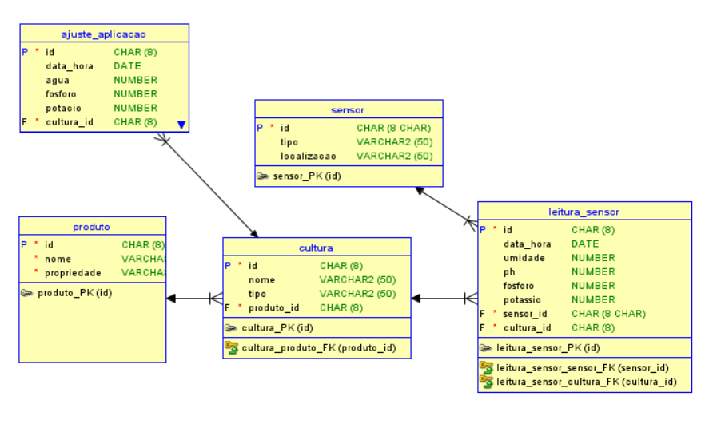

# FarmTech - Sistema de Monitoramento Agrícola

## Modelo Entidade Relacionamento (MER)

### Entidades

#### 1. Sensor
- **Descrição**: Representa os sensores instalados nas culturas para monitoramento.
- **Atributos**:
  - `id` (PK): Identificador único do sensor (CHAR(8))
  - `tipo`: Tipo do sensor (VARCHAR2(50))
  - `localizacao`: Localização física do sensor (VARCHAR2(50))

#### 2. Cultura
- **Descrição**: Representa as culturas agrícolas monitoradas.
- **Atributos**:
  - `id` (PK): Identificador único da cultura (CHAR(8))
  - `nome`: Nome da cultura (VARCHAR2(50))
  - `tipo`: Tipo da cultura (VARCHAR2(50))
  - `produtor_id` (FK): Referência ao produtor responsável (CHAR(8))

#### 3. Produtor
- **Descrição**: Representa os produtores agrícolas responsáveis pelas culturas.
- **Atributos**:
  - `id` (PK): Identificador único do produtor (CHAR(8))
  - `nome`: Nome do produtor (VARCHAR2(50))
  - `propriedade`: Nome da propriedade (VARCHAR2(50))

#### 4. Leitura_Sensor
- **Descrição**: Registra as leituras realizadas pelos sensores.
- **Atributos**:
  - `id` (PK): Identificador único da leitura (CHAR(8))
  - `data_hora`: Data e hora da leitura (DATE)
  - `umidade`: Nível de umidade (NUMBER)
  - `ph`: Nível de pH (NUMBER)
  - `fosforo`: Nível de fósforo (NUMBER)
  - `potassio`: Nível de potássio (NUMBER)
  - `sensor_id` (FK): Referência ao sensor (CHAR(8))
  - `cultura_id` (FK): Referência à cultura (CHAR(8))

#### 5. Ajuste_Aplicacao
- **Descrição**: Registra os ajustes e aplicações realizados nas culturas.
- **Atributos**:
  - `id` (PK): Identificador único do ajuste (CHAR(8))
  - `data_hora`: Data e hora do ajuste (DATE)
  - `agua`: Quantidade de água (NUMBER)
  - `fosforo`: Quantidade de fósforo (NUMBER)
  - `potacio`: Quantidade de potássio (NUMBER)
  - `cultura_id` (FK): Referência à cultura (CHAR(8))

### Relacionamentos

1. **Cultura - Produtor (N:1)**
   - Uma cultura está associada a um produtor
   - Um produtor pode ter várias culturas

2. **Leitura_Sensor - Sensor (N:1)**
   - Um sensor pode ter várias leituras
   - Cada leitura está associada a um sensor

3. **Leitura_Sensor - Cultura (N:1)**
   - Uma cultura pode ter várias leituras
   - Cada leitura está associada a uma cultura

4. **Ajuste_Aplicacao - Cultura (N:1)**
   - Uma cultura pode ter vários ajustes
   - Cada ajuste está associado a uma cultura

## Diagrama do Modelo 

## Regras de Negócio

1. Todo sensor deve estar associado a uma cultura específica
2. As leituras dos sensores devem ser registradas com data e hora
3. Os ajustes de aplicação são baseados nas leituras dos sensores
4. Cada cultura deve estar associada a um produtor específico
5. Os sensores podem monitorar diferentes parâmetros (umidade, pH, fósforo, potássio)
6. Os ajustes de aplicação registram as correções necessárias para otimizar o cultivo 